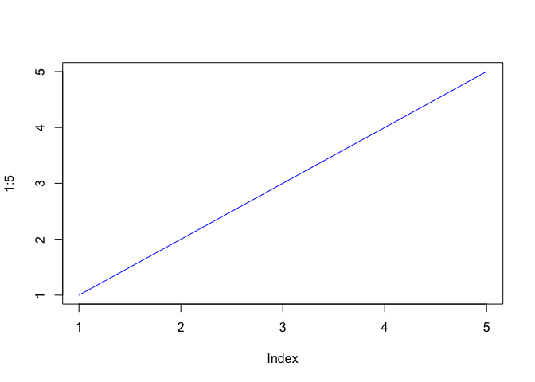
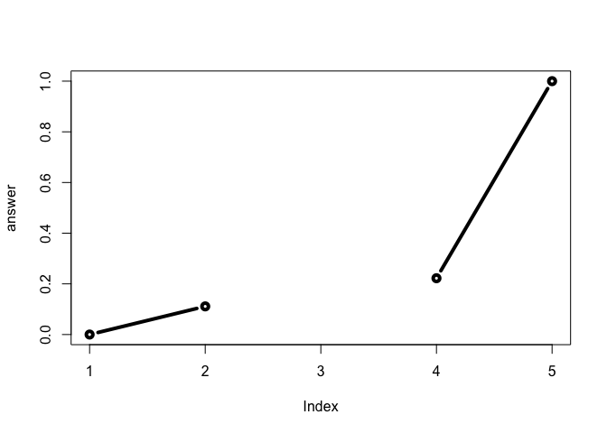
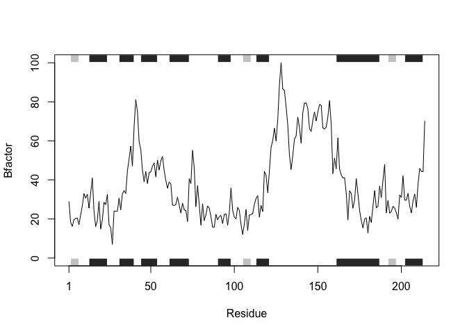
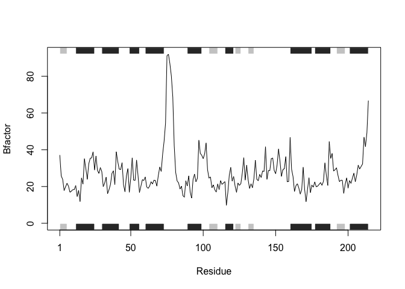
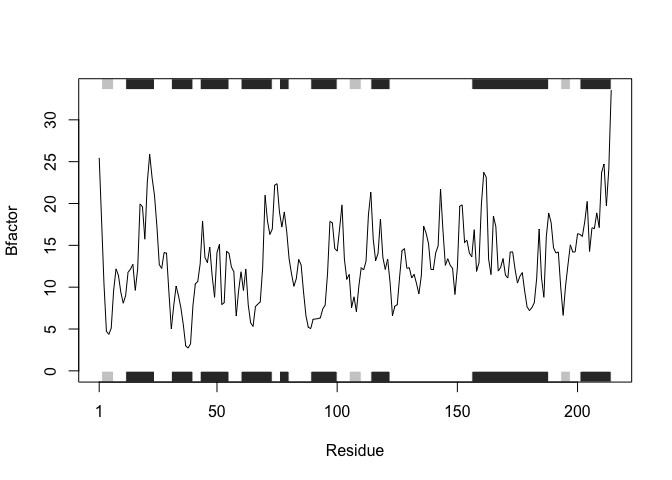
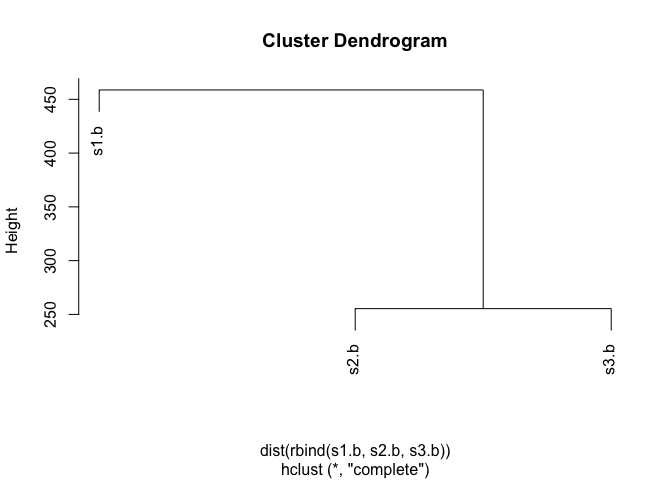

class06
================
Zoheb Khaliqi
1/23/2020

## R Markdown

This is an R Markdown document. Markdown is a simple formatting syntax
for authoring HTML, PDF, and MS Word documents. For more details on
using R Markdown see <http://rmarkdown.rstudio.com>.

When you click the **Knit** button a document will be generated that
includes both content as well as the output of any embedded R code
chunks within the document. You can embed an R code chunk like this:

``` r
summary(cars)
```

    ##      speed           dist       
    ##  Min.   : 4.0   Min.   :  2.00  
    ##  1st Qu.:12.0   1st Qu.: 26.00  
    ##  Median :15.0   Median : 36.00  
    ##  Mean   :15.4   Mean   : 42.98  
    ##  3rd Qu.:19.0   3rd Qu.: 56.00  
    ##  Max.   :25.0   Max.   :120.00

``` r
plot(1:5, typ="l", col="blue")
```

<!-- -->

Lets see more about **file import** (i.e. reading files into R). The
main read function in base R is `read.table()`

``` r
t1 <- read.table("test1.txt")
```

We need to add arguments to get this file imported

``` r
t1 <- read.table("test1.txt", sep=",", header=TRUE)
```

Or I could just use `read.csv()` which has the arguments I want in this
case

``` r
t1 <- read.csv("test1.txt")
t1
```

    ##   Col1 Col2 Col3
    ## 1    1    2    3
    ## 2    4    5    6
    ## 3    7    8    9
    ## 4    a    b    c

``` r
t2 <- read.table("test2.txt", sep="$", header=TRUE)
t2
```

    ##   Col1 Col2 Col3
    ## 1    1    2    3
    ## 2    4    5    6
    ## 3    7    8    9
    ## 4    a    b    c

``` r
t3 <- read.table("test3.txt")
t3
```

    ##   V1 V2 V3
    ## 1  1  6  a
    ## 2  2  7  b
    ## 3  3  8  c
    ## 4  4  9  d
    ## 5  5 10  e

# Back to functions

Our first example function

``` r
add <- function(x, y=1) {
    # Sum the input x and y
    x + y
}
```

Let’s try this function

``` r
add(7,3)
```

    ## [1] 10

How does this work with vectors as input?

``` r
add( c(1,2,4) )
```

    ## [1] 2 3 5

``` r
add( c(1,2,4), 4 )
```

    ## [1] 5 6 8

``` r
add( c(1,2,4), c(1,2,4) )
```

    ## [1] 2 4 8

``` r
#add( c(1,2,4), 1,2,4 )
```

What is this `range()` function you talk of?

``` r
x <- c(4,4,10,3,11)
max(x)
```

    ## [1] 11

``` r
min(x)
```

    ## [1] 3

``` r
range(x)
```

    ## [1]  3 11

This is our second function:

``` r
rescale <- function(x) {
 rng <-range(x)
 (x - rng[1]) / (rng[2] - rng[1])
}
```

``` r
rescale(x)
```

    ## [1] 0.125 0.125 0.875 0.000 1.000

Do some more
    testing

``` r
rescale(1:10)
```

    ##  [1] 0.0000000 0.1111111 0.2222222 0.3333333 0.4444444 0.5555556 0.6666667
    ##  [8] 0.7777778 0.8888889 1.0000000

How would function work here?

``` r
rescale( c(1,2,NA,3,10) )
```

    ## [1] NA NA NA NA NA

``` r
x <- c(1,2,NA,3,10)
rng <-range(x)
rng
```

    ## [1] NA NA

``` r
rng <-range(x, na.rm=TRUE)
rng
```

    ## [1]  1 10

``` r
rescale2 <- function(x) {
 rng <-range(x, na.rm=TRUE)
 (x - rng[1]) / (rng[2] - rng[1])
}
```

``` r
rescale( c(1,2,NA,3,10) )
```

    ## [1] NA NA NA NA NA

Going too far

``` r
rescale3 <- function(x, na.rm=TRUE, plot=FALSE) {
 rng <-range(x, na.rm=na.rm)
 print("Hello")
 answer <- (x - rng[1]) / (rng[2] - rng[1])
 print("is it me you are looking for?")
 if(plot) {
 plot(answer, typ="b", lwd=4)
 }
 print("I can see it in ...")
 return(answer)
}
```

``` r
rescale3(x)
```

    ## [1] "Hello"
    ## [1] "is it me you are looking for?"
    ## [1] "I can see it in ..."

    ## [1] 0.0000000 0.1111111        NA 0.2222222 1.0000000

``` r
rescale3(x, plot=TRUE)
```

    ## [1] "Hello"
    ## [1] "is it me you are looking for?"

<!-- -->

    ## [1] "I can see it in ..."

    ## [1] 0.0000000 0.1111111        NA 0.2222222 1.0000000

Hands on section B.

``` r
library(bio3d)
```

``` r
library(bio3d)
s1 <- read.pdb("4AKE") # kinase with drug
```

    ##   Note: Accessing on-line PDB file

``` r
s2 <- read.pdb("1AKE") # kinase no drug
```

    ##   Note: Accessing on-line PDB file
    ##    PDB has ALT records, taking A only, rm.alt=TRUE

``` r
s3 <- read.pdb("1E4Y") # kinase with drug
```

    ##   Note: Accessing on-line PDB file

``` r
s1.chainA <- trim.pdb(s1, chain="A", elety="CA")
s2.chainA <- trim.pdb(s2, chain="A", elety="CA")
s3.chainA <- trim.pdb(s3, chain="A", elety="CA")

s1.b <- s1.chainA$atom$b
s2.b <- s2.chainA$atom$b
s3.b <- s3.chainA$atom$b

plotb3(s1.b, sse=s1.chainA, typ="l", ylab="Bfactor")
```

<!-- -->

``` r
plotb3(s2.b, sse=s2.chainA, typ="l", ylab="Bfactor")
```

<!-- -->

``` r
plotb3(s3.b, sse=s3.chainA, typ="l", ylab="Bfactor")
```

<!-- -->

``` r
hc <- hclust( dist( rbind(s1.b, s2.b, s3.b) ) )
plot(hc)
```

<!-- -->

``` r
library(bio3d)
pd_interaction <- function(code) {
  s <- read.pdb(code) 
  s.chainA <- trim.pdb(s, chain="A", elety="CA")
  s.b <- s.chainA$atom$b
  plotb3(s.b, sse=s.chainA, typ="l", ylab="Bfactor")

}
```

``` r
pd_interaction("1E4Y")
```

    ##   Note: Accessing on-line PDB file

    ## Warning in get.pdb(file, path = tempdir(), verbose = FALSE): /var/folders/5t/
    ## pyxd4wwd5lvck_gbsgvxpw1c0000gn/T//RtmpeUT78I/1E4Y.pdb exists. Skipping download

<!-- -->
