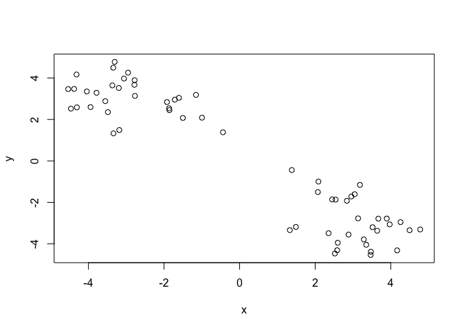
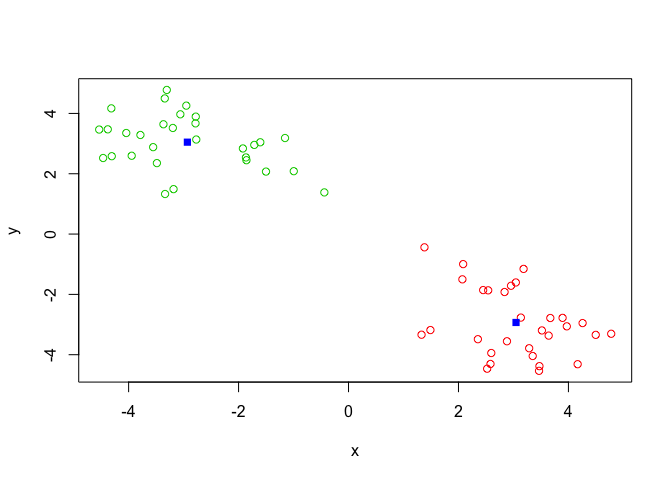
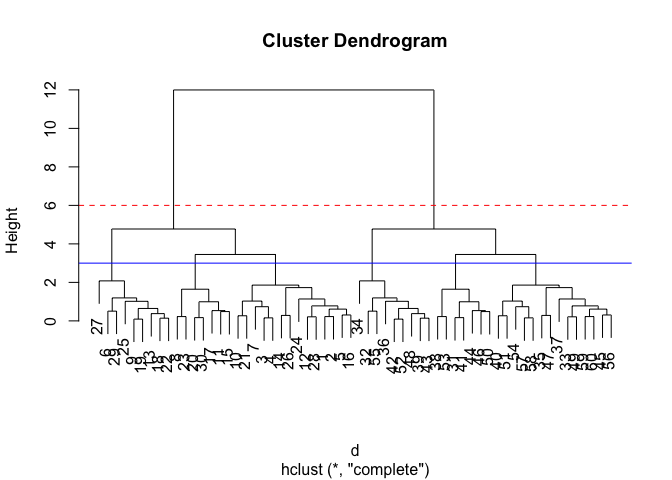
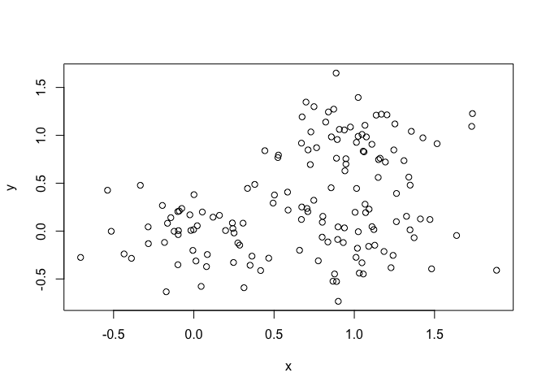
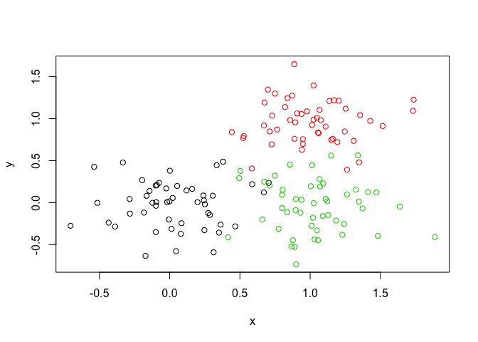
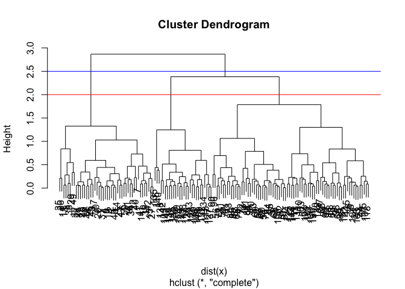
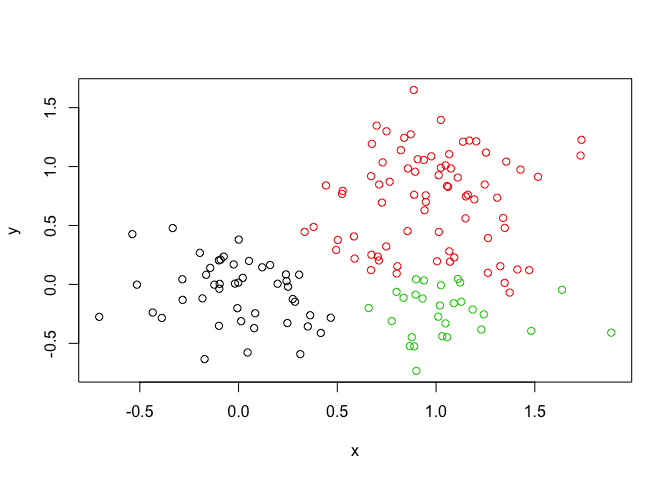
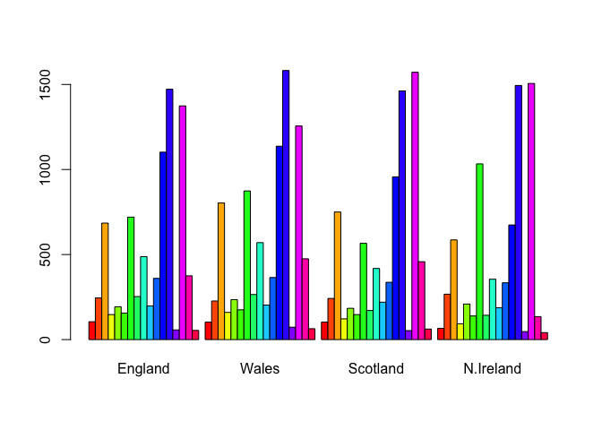
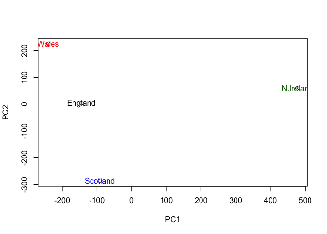

class09
================
Zoheb Khaliqi
2/4/2020

# K-means clustering

The main k-means function in R is called ‘kmeans()’. Let’s play with it
here.

``` r
#Generate some example data for clustering
tmp <- c(rnorm(30,-3), rnorm(30,3))
x <- cbind(x=tmp, y=rev(tmp))

plot(x)
```

<!-- -->

Use kmeans() function setting k to 2 and nstart=20

``` r
km <- kmeans(x, centers = 2, nstart = 20)
km
```

    ## K-means clustering with 2 clusters of sizes 30, 30
    ## 
    ## Cluster means:
    ##           x         y
    ## 1  3.046855 -2.931309
    ## 2 -2.931309  3.046855
    ## 
    ## Clustering vector:
    ##  [1] 2 2 2 2 2 2 2 2 2 2 2 2 2 2 2 2 2 2 2 2 2 2 2 2 2 2 2 2 2 2 1 1 1 1 1 1 1 1
    ## [39] 1 1 1 1 1 1 1 1 1 1 1 1 1 1 1 1 1 1 1 1 1 1
    ## 
    ## Within cluster sum of squares by cluster:
    ## [1] 59.88695 59.88695
    ##  (between_SS / total_SS =  90.0 %)
    ## 
    ## Available components:
    ## 
    ## [1] "cluster"      "centers"      "totss"        "withinss"     "tot.withinss"
    ## [6] "betweenss"    "size"         "iter"         "ifault"

``` r
km$size # Gives cluster size
```

    ## [1] 30 30

``` r
km$cluster # Gives cluster assignment/membership
```

    ##  [1] 2 2 2 2 2 2 2 2 2 2 2 2 2 2 2 2 2 2 2 2 2 2 2 2 2 2 2 2 2 2 1 1 1 1 1 1 1 1
    ## [39] 1 1 1 1 1 1 1 1 1 1 1 1 1 1 1 1 1 1 1 1 1 1

``` r
km$centers # Gives cluster center
```

    ##           x         y
    ## 1  3.046855 -2.931309
    ## 2 -2.931309  3.046855

``` r
# Plot x colored by the kmeans cluster assignment and add cluster centers as blue points
plot(x, col=km$cluster+1)
points(km$centers, col="blue", pch=15)
```

<!-- -->

# Hierarchical clustering in R

The main Hierarchical clustering function in R is called ‘hclust()’ An
important point here is that you have to calculate the distance matrix
deom your impot data before calling ‘hclust()’.

For this we will use the ‘dist()’ function first.

``` r
# We will use our x again from above
d <- dist(x)
hc <- hclust(d)
hc
```

    ## 
    ## Call:
    ## hclust(d = d)
    ## 
    ## Cluster method   : complete 
    ## Distance         : euclidean 
    ## Number of objects: 60

Folks often view the results of Hierarchical clustering grahicaly. Lets
trypassing this to the ‘plot’ function.

``` r
plot(hc)
abline(h=6, col="red", lty=2) # Draws a line at height 6; see the 2 clusters
abline(h=3, col="blue")
```

<!-- -->

To get cluster membershup vector I need to “cut” tge tree at a certain
height to yield my seperate cluster
    branches.

``` r
cutree(hc, h=6)
```

    ##  [1] 1 1 1 1 1 1 1 1 1 1 1 1 1 1 1 1 1 1 1 1 1 1 1 1 1 1 1 1 1 1 2 2 2 2 2 2 2 2
    ## [39] 2 2 2 2 2 2 2 2 2 2 2 2 2 2 2 2 2 2 2 2 2 2

``` r
gp3 <- cutree(hc, k=6)
table(gp3)
```

    ## gp3
    ##  1  2  3  4  5  6 
    ## 14  9  7  7  9 14

``` r
# Step 1. Generate some example data for clustering
x <- rbind(
 matrix(rnorm(100, mean=0, sd = 0.3), ncol = 2), # c1
 matrix(rnorm(100, mean = 1, sd = 0.3), ncol = 2), # c2
 matrix(c(rnorm(50, mean = 1, sd = 0.3), # c3
 rnorm(50, mean = 0, sd = 0.3)), ncol = 2))
colnames(x) <- c("x", "y")
# Step 2. Plot the data without clustering
plot(x)
```

<!-- -->

``` r
# Step 3. Generate colors for known clusters
# (just so we can compare to hclust results)
col <- as.factor( rep(c("c1","c2","c3"), each=50) )
plot(x, col=col)
```

<!-- -->

``` r
hc2 <- hclust(dist(x))
plot(hc2)
abline(h=2, col="red")
abline(h=2.5, col="blue")
```

<!-- -->

To get cluster membership vector use `cutree()`

``` r
gp2 <- cutree(hc2, k=2)
table(gp2)
```

    ## gp2
    ##   1   2 
    ##  46 104

``` r
gp4 <- cutree(hc2, k=3)
table(gp4)
```

    ## gp4
    ##  1  2  3 
    ## 46 76 28

Make a pplot with our cluster results

``` r
plot(x, col=gp4)
```

<!-- -->

In-Class Lab

``` r
x <- read.csv("UK_foods.csv", row.names = 1)
x
```

    ##                     England Wales Scotland N.Ireland
    ## Cheese                  105   103      103        66
    ## Carcass_meat            245   227      242       267
    ## Other_meat              685   803      750       586
    ## Fish                    147   160      122        93
    ## Fats_and_oils           193   235      184       209
    ## Sugars                  156   175      147       139
    ## Fresh_potatoes          720   874      566      1033
    ## Fresh_Veg               253   265      171       143
    ## Other_Veg               488   570      418       355
    ## Processed_potatoes      198   203      220       187
    ## Processed_Veg           360   365      337       334
    ## Fresh_fruit            1102  1137      957       674
    ## Cereals                1472  1582     1462      1494
    ## Beverages                57    73       53        47
    ## Soft_drinks            1374  1256     1572      1506
    ## Alcoholic_drinks        375   475      458       135
    ## Confectionery            54    64       62        41

Let’s make some plots to explore our data a bit more

``` r
barplot(as.matrix(x), beside=T, col=rainbow(nrow(x)))
```

<!-- -->

A “pairs” plot can help when we have small datasets like this one but
often we are dealing with data that is too large for these approaches

``` r
pairs(x, col=rainbow(10), pch=16)
```

<!-- -->

Principal Component Analysis (PCA) with the `prcomp()` function

``` r
pca <- prcomp(t(x))
#pca
```

What is in my result object `pca`? I can check the attributes…

``` r
attributes(pca) 
```

    ## $names
    ## [1] "sdev"     "rotation" "center"   "scale"    "x"       
    ## 
    ## $class
    ## [1] "prcomp"

``` r
plot(pca$x[,1], pca$x[,2], xlab="PC1", ylab="PC2")
text(pca$x[,1], pca$x[,2], colnames(x), col=c("black", "red", "blue", "darkgreen"))
```

<!-- -->

``` r
summary(pca)
```

    ## Importance of components:
    ##                             PC1      PC2      PC3       PC4
    ## Standard deviation     324.1502 212.7478 73.87622 4.189e-14
    ## Proportion of Variance   0.6744   0.2905  0.03503 0.000e+00
    ## Cumulative Proportion    0.6744   0.9650  1.00000 1.000e+00
